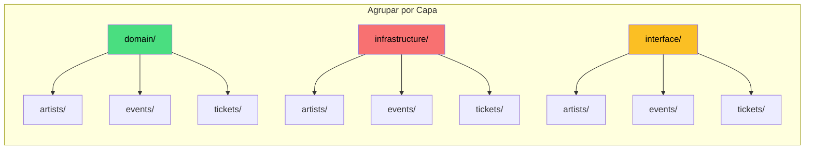
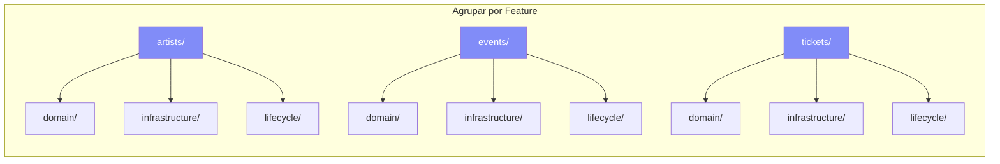
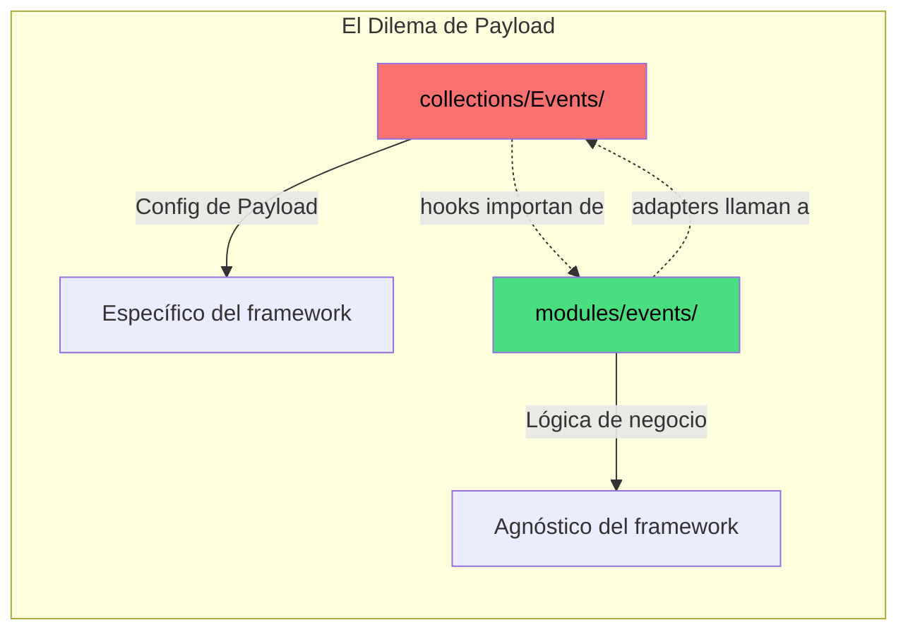
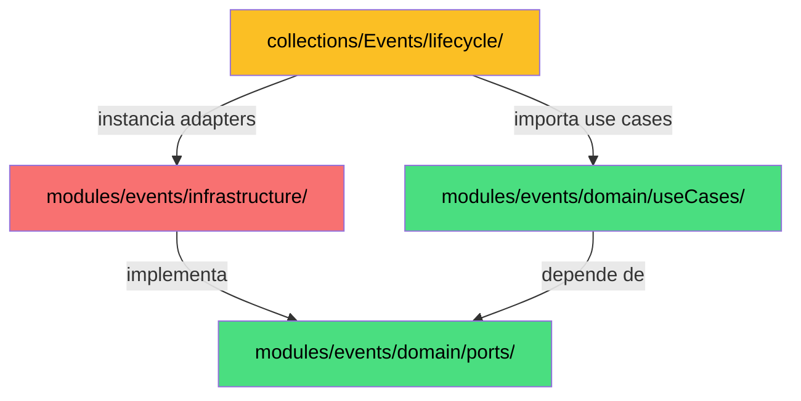
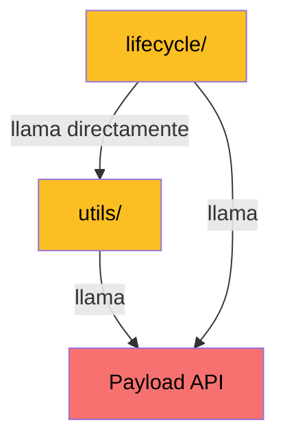
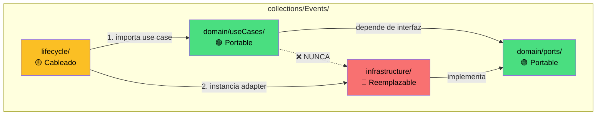
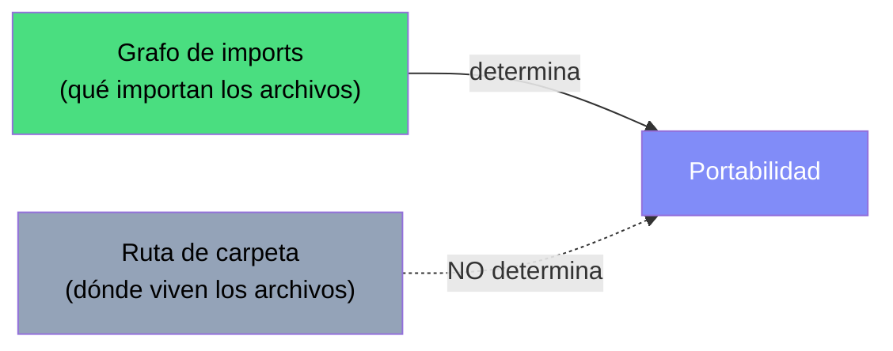
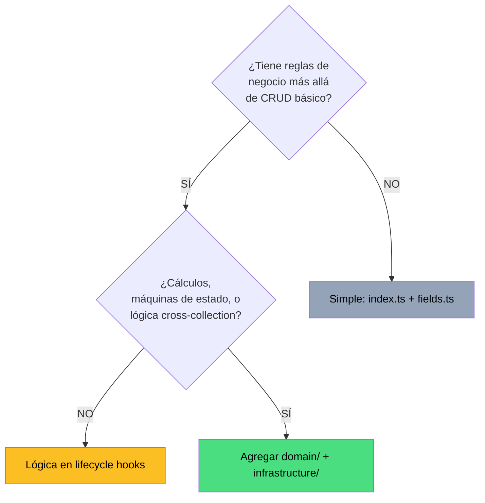
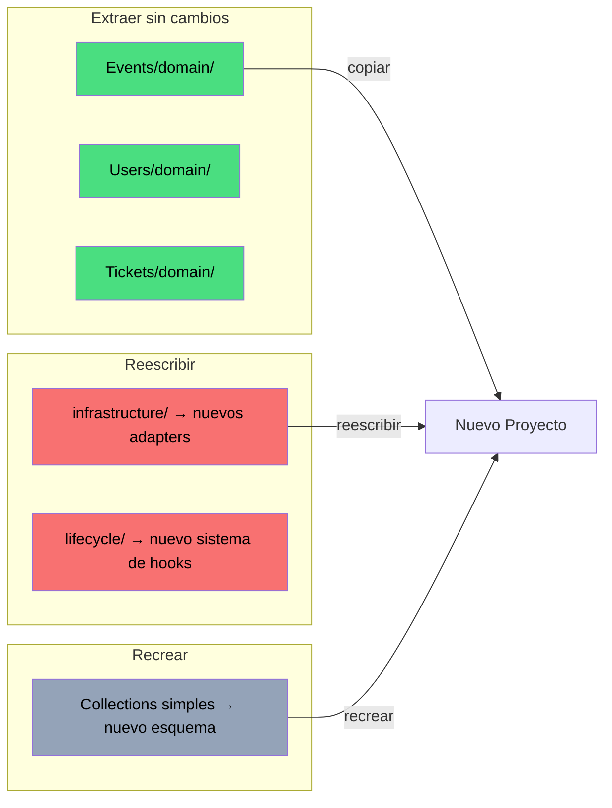

# Clean Architecture para Payload CMS — v2

**Evolución de:** `CLEAN-Payload.md` (v1 — patrones PaintPulse)
**Alcance:** Principios agnósticos de framework aplicados a cualquier proyecto Payload CMS

---

## Tabla de Contenidos

1. [El Debate Fundamental](#1-el-debate-fundamental)
2. [Cómo se Manifiesta en Payload CMS](#2-cómo-se-manifiesta-en-payload-cms)
3. [Enfoque A: Agrupar por Capa](#3-enfoque-a-agrupar-por-capa)
4. [Enfoque B: Agrupar por Feature, Sin Aislamiento](#4-enfoque-b-agrupar-por-feature-sin-aislamiento)
5. [Enfoque C: El Híbrido (Recomendado)](#5-enfoque-c-el-híbrido-recomendado)
6. [Las Tres Reglas](#6-las-tres-reglas)
7. [Anatomía de Cada Capa](#7-anatomía-de-cada-capa)
8. [Hook Wrappers y Manifiestos de Lifecycle](#8-hook-wrappers-y-manifiestos-de-lifecycle)
9. [Cuándo Agregar Lógica de Dominio](#9-cuándo-agregar-lógica-de-dominio)
10. [Preparación para Migración](#10-preparación-para-migración)
11. [Enforcement con ESLint](#11-enforcement-con-eslint)
12. [Resumen Comparativo](#12-resumen-comparativo)

---

## 1. El Debate Fundamental

Clean Architecture tiene un debate histórico que antecede a Payload CMS:

> **Agrupar por Capa** vs. **Agrupar por Feature (Módulo)**

Esta es la pregunta raíz detrás de toda discusión sobre módulos, colecciones, dominios y carpetas de infraestructura.

### Agrupar por Capa

Organizar archivos por su **rol arquitectónico**. Toda la lógica de dominio en un árbol, toda la infraestructura en otro:

```
src/
├── domain/
│   ├── artists/
│   ├── events/
│   ├── tickets/
│   └── users/
├── infrastructure/
│   ├── artists/
│   ├── events/
│   ├── tickets/
│   └── users/
└── interface/
    ├── artists/
    ├── events/
    ├── tickets/
    └── users/
```

### Agrupar por Feature

Organizar archivos por su **dominio de negocio**. Todo sobre "Events" en una sola carpeta:

```
src/
├── events/
│   ├── domain/
│   ├── infrastructure/
│   └── lifecycle/
├── tickets/
│   ├── domain/
│   ├── infrastructure/
│   └── lifecycle/
└── users/
    ├── domain/
    ├── infrastructure/
    └── lifecycle/
```

### La Diferencia Clave Visualizada





### Por Qué Gana Agrupar por Feature

Robert C. Martin (Clean Architecture, Capítulo 34):

> *"Agrupar por feature promueve alta cohesión dentro de un módulo y bajo acoplamiento entre módulos."*

| Escenario | Agrupar por Capa | Agrupar por Feature |
|---|---|---|
| "Muéstrame todo sobre Events" | Abrir 3+ directorios | Abrir 1 directorio |
| "Agregar funcionalidad a Tickets" | Tocar archivos en 3+ dirs | Tocar archivos en 1 dir |
| "Eliminar la feature Artists" | Buscar en 3+ dirs | Eliminar 1 directorio |
| "¿Qué features tienen lógica de dominio?" | Escanear cada subcarpeta en `domain/` | Ver qué features tienen `domain/` |

---

## 2. Cómo se Manifiesta en Payload CMS

Payload CMS introduce su propio concepto organizador: **collections**. Una collection ya es una "carpeta de feature" — contiene el esquema, configuración admin, reglas de acceso y hooks para una sola entidad de datos.

El debate se convierte en:



Tres posibles arquitecturas emergen:

| Enfoque | Dónde vive la lógica de dominio | Estilo |
|---|---|---|
| **A: Módulos Separados** | `modules/events/domain/` | Por capa |
| **B: Integrado, Sin Aislamiento** | `collections/Events/utils/` | Por feature, sin límites |
| **C: Integrado + Aislado** | `collections/Events/domain/` | Por feature, límites estrictos |

---

## 3. Enfoque A: Agrupar por Capa

Lógica de dominio en una carpeta top-level `modules/`, separada de `collections/`.

```
src/
├── collections/                  ← Configs de Payload
│   ├── Events/
│   │   ├── index.ts
│   │   ├── fields.ts
│   │   └── lifecycle/            ← Hooks importan de modules/
│   └── ... (30+ colecciones)
└── modules/                      ← Lógica de negocio
    ├── events/
    │   ├── domain/useCases/
    │   └── infrastructure/payload/
    ├── tickets/
    ├── artists/                  ← Frecuentemente scaffold vacío
    └── ...
```



| ✅ Pros | ❌ Contras |
|---|---|
| Estructura Clean Architecture de libro | Split-brain: 2 árboles de directorios por feature |
| Dominio físicamente separado | Mapeo 1:1 — cada módulo espeja una collection |
| Límite visual claro | 30+ collections → 30+ modules, la mayoría vacíos |
| | Rutas de import largas y verbosas |

**Elegir cuando:** Múltiples proveedores de infraestructura consumen el mismo dominio, o equipos grandes con desarrolladores de backend y CMS separados.

---

## 4. Enfoque B: Agrupar por Feature (Sin Aislamiento)

Todo dentro de la collection, sin separación entre dominio e infraestructura.

```
src/
└── collections/
    └── Events/
        ├── index.ts
        ├── fields.ts
        ├── utils/calculateSomething.ts    ← Lógica + Payload mezclados
        └── lifecycle/onBeforeChange.ts    ← Contiene lógica directamente
```



| ✅ Pros | ❌ Contras |
|---|---|
| Máxima simplicidad | Lógica de negocio acoplada a Payload |
| Abrir una carpeta, ver todo | Sin ruta de migración |
| Sin overhead de abstracción | Reglas ocultas dentro de hooks |

**Elegir cuando:** Proyecto pequeño, desarrollador solo, prototipo/MVP, sin planes de migración.

---

## 5. Enfoque C: El Híbrido ✅ Recomendado

Todo dentro de la collection, pero las subcarpetas `domain/` son **estrictamente agnósticas del framework**.

```
src/
└── collections/
    ├── Events/
    │   ├── index.ts                        ← Payload CollectionConfig
    │   ├── fields.ts                       ← Definiciones de campos
    │   ├── components/                     ← UI Admin
    │   ├── domain/                         ← 🟢 PORTABLE
    │   │   ├── entities/Event.ts
    │   │   ├── ports/ITicketRepository.ts
    │   │   ├── useCases/expireTickets.ts
    │   │   └── errors.ts
    │   ├── infrastructure/                 ← 🔴 REEMPLAZABLE
    │   │   ├── PayloadTicketRepository.ts
    │   │   └── EventMapper.ts
    │   └── lifecycle/                      ← 🟡 CABLEADO
    │       ├── index.ts
    │       └── expireTickets.ts
    ├── Artists/                            ← Simple: SIN domain/
    │   ├── index.ts
    │   └── fields.ts
    └── Banks/                             ← Datos puros: SIN domain/
        ├── index.ts
        └── fields.ts
```



### Por Qué Funciona

**La portabilidad está determinada por el grafo de imports, no por la ruta de la carpeta.**



Una carpeta `domain/` dentro de `collections/Events/` es exactamente tan portable como una dentro de `modules/events/` — porque la portabilidad depende de si el archivo importa `payload` (no lo hace), no del nombre de su directorio padre.

---

## 6. Las Tres Reglas

No negociables, enforced vía ESLint:

**Regla 1 — `domain/` tiene CERO imports del framework**

```typescript
// ✅ Permitido dentro de domain/
import type { Product } from '../entities/Product'
// ❌ NUNCA permitido dentro de domain/
import type { Payload } from 'payload'
```

**Regla 2 — Las dependencias fluyen hacia adentro solamente**

```
domain/          ← NUNCA importa de infrastructure/ o lifecycle/
infrastructure/  ← importa de domain/ (implementa sus ports)
lifecycle/       ← importa de AMBOS (cableado)
```

**Regla 3 — `lifecycle/` es el composition root**

```typescript
import { calculatePrice } from '../domain/useCases/calculatePrice'
import { PayloadPricingRepo } from '../infrastructure/PayloadPricingRepo'

export const calculatePriceHook = handleBeforeChangeHook({
    handler: async ({ data, req }) => {
        const repo = new PayloadPricingRepo(req)
        return await calculatePrice(data, repo)
    },
})
```

---

## 7. Anatomía de Cada Capa

### Dominio: Entidades

Modelos tipados puros — NO los tipos generados de Payload.

```typescript
// domain/entities/Order.ts — sin imports de framework
export interface OrderEntity {
    id: string
    userId: string
    status: OrderStatus
    items: OrderItem[]
    totalAmount: number
}
export type OrderStatus = 'pending' | 'confirmed' | 'shipped' | 'cancelled'
```

### Dominio: Ports

Contratos que el dominio necesita. Interfaces agnósticas del framework.

```typescript
// domain/ports/IOrderRepository.ts
export interface IOrderRepository {
    findById(id: string): Promise<OrderEntity | null>
    updateStatus(id: string, status: OrderStatus): Promise<void>
}
```

### Dominio: Use Cases

Lógica de negocio pura. Cero imports de framework.

```typescript
// domain/useCases/cancelOrder.ts
import type { IOrderRepository } from '../ports/IOrderRepository'
import { OrderCancellationError } from '../errors'

const CANCELLABLE = ['pending', 'confirmed']

export async function cancelOrder(orderId: string, orderRepo: IOrderRepository) {
    const order = await orderRepo.findById(orderId)
    if (!order) throw new OrderCancellationError(`Orden ${orderId} no encontrada`)
    if (!CANCELLABLE.includes(order.status)) {
        throw new OrderCancellationError(`No se puede cancelar: ${order.status}`)
    }
    await orderRepo.updateStatus(orderId, 'cancelled')
}
```

### Infraestructura: Adapters

Implementan ports usando Payload.

```typescript
// infrastructure/PayloadOrderRepository.ts
import type { PayloadRequest } from 'payload'
import type { IOrderRepository } from '../domain/ports/IOrderRepository'
import { OrderMapper } from './OrderMapper'

export class PayloadOrderRepository implements IOrderRepository {
    constructor(private readonly req: PayloadRequest) {}

    async findById(id: string) {
        const doc = await this.req.payload.findByID({ collection: 'orders', id })
        return doc ? OrderMapper.toEntity(doc) : null
    }

    async updateStatus(id: string, status: string) {
        await this.req.payload.update({
            collection: 'orders', id, data: { orderStatus: status },
        })
    }
}
```

### Infraestructura: Mappers

Convierten documentos de Payload ↔ entidades de dominio.

```typescript
// infrastructure/OrderMapper.ts
import type { Order as PayloadOrder } from '@/payload-types'
import type { OrderEntity } from '../domain/entities/Order'

export class OrderMapper {
    static toEntity(doc: PayloadOrder): OrderEntity {
        return {
            id: String(doc.id),
            userId: typeof doc.user === 'object' ? String(doc.user.id) : String(doc.user),
            status: doc.orderStatus as OrderEntity['status'],
            totalAmount: doc.pricing?.total ?? 0,
            items: (doc.items ?? []).map(i => ({
                productId: typeof i.product === 'object' ? String(i.product.id) : String(i.product),
                quantity: i.quantity,
                unitPrice: i.unitPrice,
            })),
        }
    }
}
```

---

## 8. Hook Wrappers y Manifiestos de Lifecycle

*(Continuación de v1)*

Todos los hooks usan wrappers estandarizados de `@/shared/handlers`:

- `handleBeforeChangeHook` — valida/transforma antes de guardar
- `handleAfterChangeHook` — efectos secundarios después de guardar
- `handleBeforeDeleteHook` / `handleAfterDeleteHook`

Cada collection tiene un **manifiesto de lifecycle**:

```typescript
// lifecycle/index.ts
/**
 * ORDER LIFECYCLE
 * beforeChange:  calculatePrice, validateInventory
 * afterChange:   emitOrderCreated [create]
 */
export const orderLifecycle: CollectionConfig['hooks'] = {
    beforeChange: [calculatePriceHook, validateInventoryHook],
    afterChange: [emitOrderCreatedHook],
}
```

---

## 9. Cuándo Agregar Lógica de Dominio



**No necesitan `domain/`:** Media, Categories, Tags, Countries, Banks, Pages de CMS

**Sí necesitan `domain/`:** Orders, Users, Tickets, Payments — cualquier cosa con reglas de negocio complejas

---

## 10. Preparación para Migración



| Paso | Acción | Esfuerzo |
|---|---|---|
| Extraer dominio | Copiar carpetas `domain/` — cero cambios | 🟢 Trivial |
| Reescribir adapters | Nuevas implementaciones de los mismos ports | 🟡 Medio |
| Reescribir cableado | Nuevo sistema de hooks | 🟡 Medio |
| Recrear esquemas | Collections de datos simples | 🟢 Bajo |

---

## 11. Enforcement con ESLint

```json
{
  "overrides": [
    {
      "files": ["src/collections/*/domain/**/*.ts"],
      "rules": {
        "no-restricted-imports": ["error", {
          "patterns": [
            {
              "group": ["payload", "payload/*", "@payloadcms/*"],
              "message": "La capa de dominio no debe importar de Payload CMS."
            },
            {
              "group": ["../infrastructure/*", "../lifecycle/*"],
              "message": "El dominio no debe depender de infraestructura ni lifecycle."
            }
          ]
        }]
      }
    }
  ]
}
```

---

## 12. Resumen Comparativo

| Criterio | A: Módulos Separados | B: Sin Aislamiento | C: Híbrido ✅ |
|---|---|---|---|
| **Principio** | Por capa | Por feature | Por feature + capas internas |
| **Navegación** | 2 árboles | 1 carpeta | 1 carpeta |
| **Listo para migrar** | ✅ Separado | ❌ Acoplado | ✅ Separado por grafo de imports |
| **Escalabilidad** | ❌ Scaffolds vacíos | ✅ Lean | ✅ Lean |
| **Enforcement** | Separación de carpetas | Ninguno | Reglas ESLint |
| **DX** | ❌ Cambio de contexto | ✅ Intuitivo | ✅ Intuitivo |
| **Eliminar feature** | Buscar en 2+ dirs | Eliminar 1 dir | Eliminar 1 dir |

### La Conclusión

> **El principio central de Clean Architecture es inversión de dependencias, no estructura de carpetas.**
>
> Lo que hace portable al código es el **grafo de imports** (qué importan los archivos), no la **ruta de carpeta** (dónde viven los archivos). Una carpeta `domain/` dentro de `collections/Events/` es exactamente tan portable como una dentro de `modules/events/`.
>
> **Agrupar por feature. Capas por convención. Enforcement por lint.**
